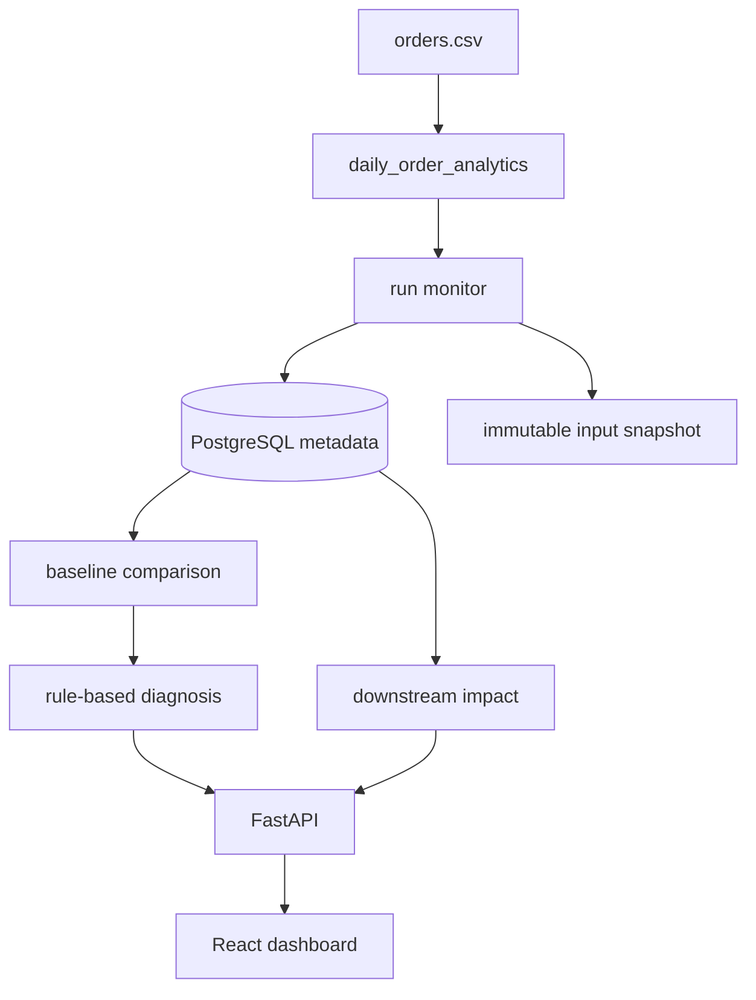

# Runomaly

Runomaly is a failure investigation tool for data pipelines. The first version focuses on one pipeline, `daily_order_analytics`, and implements the investigation workflow end to end: capture the run, snapshot the input, profile the data, compare a failed run to the last successful baseline, rank likely causes, show downstream impact, and replay the failure.

I built it around a common data-engineering question:

> This job worked yesterday. What changed today?

Instead of trying to support every orchestrator and warehouse, Runomaly goes deep on one realistic CSV-to-Postgres pipeline so the root-cause workflow is visible and testable.



## What It Does

- Runs a sample orders pipeline and writes `raw_orders`, `clean_orders`, and `daily_revenue`.
- Records run status, step timing, logs, environment metadata, input filename, and snapshot path.
- Stores dataset and column profiles before validation/transformation can fail.
- Compares failed runs with the most recent successful run for the same pipeline.
- Detects schema changes, type changes, row-count drops, null spikes, duplicate identifiers, and empty inputs.
- Ranks likely causes with severity, confidence, and supporting evidence.
- Shows downstream assets affected by a failure.
- Replays failed runs from saved input snapshots.

## Demo Flow

Start the app:

```bash
docker compose up --build
```

Open:

- Dashboard: http://localhost:5173
- API docs: http://localhost:8000/docs

In the dashboard:

1. Click `Valid run`.
2. Select the successful run and review the timeline/logs.
3. Click `Price type change`.
4. Select the failed run.
5. Open the investigation panel and check the type-change diagnosis.
6. Review affected downstream assets.
7. Click `Replay`.
8. Run `Valid run` again to show the corrected path succeeds.

Other failure buttons exercise missing columns, duplicate order IDs, email null-rate increases, row-count drops, and empty inputs.

## Why One Pipeline?

The goal of this project is depth over breadth. Supporting many pipelines would mostly add configuration work; the interesting part is the investigation loop. `daily_order_analytics` gives enough surface area to show schema validation, data profiling, SQL writes, lineage, diagnosis rules, and replay without hiding the behavior behind a huge framework.

The code is structured so more pipelines could be added later, but this version intentionally keeps one fully implemented example.

## Tech Stack

- Backend: Python 3.12, FastAPI, Pydantic, SQLAlchemy, Alembic
- Database: PostgreSQL
- Orchestration and processing: Prefect, Pandas, SQL
- Frontend: React, TypeScript, Vite
- Infrastructure: Docker, Docker Compose, GitHub Actions
- Testing: Pytest, FastAPI TestClient, PostgreSQL integration-test support

## Local Development

For a lightweight local run without Docker:

```bash
python3.12 -m venv .venv
source .venv/bin/activate
pip install -e ".[dev]"

DATABASE_URL=sqlite:///./dev_investigator.db \
SNAPSHOTS_DIR=.dev_snapshots \
SAMPLE_DATA_DIR=sample_data \
uvicorn backend.app.main:app --host 127.0.0.1 --port 8000
```

In a second terminal:

```bash
cd frontend
npm install
BACKEND_PROXY_TARGET=http://127.0.0.1:8000 npm run dev -- --host 127.0.0.1
```

Open http://127.0.0.1:5173.

## CLI

Run a successful pipeline:

```bash
python -m investigator run \
  --pipeline daily_order_analytics \
  --input sample_data/valid/orders.csv
```

Run a failure case:

```bash
python -m investigator run \
  --pipeline daily_order_analytics \
  --input sample_data/failures/price_type_change.csv
```

Inspect, compare, and replay:

```bash
python -m investigator inspect --run-id <run_id>
python -m investigator compare --run-id <run_id>
python -m investigator replay --run-id <run_id>
```

## Failure Fixtures

The project includes deliberately broken inputs under `sample_data/failures/`:

- `price_type_change.csv`
- `missing_customer_id.csv`
- `duplicate_order_ids.csv`
- `email_null_increase.csv`
- `row_count_decrease.csv`
- `empty_orders.csv`

These are meant to make the investigation workflow repeatable during a demo.

## API

The backend exposes endpoints for pipelines, runs, steps, logs, comparisons, diagnoses, impact, replay, and manual execution. The easiest way to explore them is through FastAPI docs:

http://localhost:8000/docs

The API is intentionally plain JSON so the dashboard is not the only way to inspect results.

## Database

Alembic migration:

```bash
alembic upgrade head
```

Core metadata tables include:

- `pipelines`
- `pipeline_runs`
- `pipeline_steps`
- `pipeline_logs`
- `dataset_profiles`
- `column_profiles`
- `pipeline_nodes`
- `pipeline_dependencies`
- `diagnosis_results`
- `replay_runs`

The sample pipeline also writes warehouse-style output tables:

- `raw_orders`
- `clean_orders`
- `daily_revenue`

## Tests

```bash
pytest backend/tests
black --check backend investigator
ruff check backend investigator
mypy --explicit-package-bases backend investigator
```

The test suite covers profiling, comparison rules, diagnosis ranking, impact traversal, API behavior, replay, and each bundled failure scenario. PostgreSQL-backed persistence tests run when `DATABASE_URL` points to a PostgreSQL database.

## What I Would Improve Next

- Move replay execution to a background worker instead of doing it synchronously through the API.
- Store snapshots in S3-compatible object storage for larger inputs.
- Add a pipeline registration/config layer so more pipelines can be onboarded without code changes.
- Make diagnosis thresholds configurable per pipeline.
- Add richer lineage visualization once multiple pipelines exist.

## Current Limitations due to "Prototype Status"

- One fully implemented sample pipeline.
- Rule-based diagnosis only; no ML/LLM root-cause engine.
- Replay checks failure category and failed step, not exact stack traces.
- Authentication and multi-tenant access control are intentionally left for a later version.
