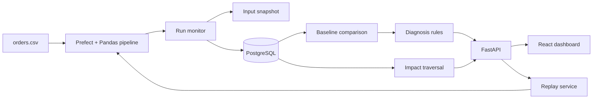

# Architecture

Runomaly is built around one idea: a failed run is only useful if it can be compared to a known-good run and reproduced from the original input.

The system has five main parts:

- `daily_order_analytics`, the sample pipeline
- monitoring and snapshot capture around every run
- PostgreSQL metadata storage
- comparison, diagnosis, and downstream-impact services
- FastAPI plus a React dashboard



## Data Flow

Each execution starts as a `RUNNING` row in `pipeline_runs`. As the pipeline moves through `load_input`, `profile_input`, `validate_schema`, `load_raw_orders`, `transform_orders`, and `calculate_revenue`, each step records timing and status.

The input CSV is copied into an immutable snapshot directory before processing continues. Dataset and column profiles are stored before validation/transformation can fail, which is important: a bad file still needs to be explainable.

If the run fails, Runomaly finds the latest successful run for the same pipeline and compares:

- missing or added columns
- inferred type changes
- row-count changes
- null-rate changes
- duplicate-rate changes
- unique-value changes
- numeric ranges
- git commit, dependency versions, and pipeline parameters
- error type and error message

The diagnosis service converts those differences into ranked likely causes. The impact service starts from the failed pipeline node and walks downstream dependencies.

## Why These Choices

FastAPI keeps the backend simple and gives useful API docs for free. The app is meant to be inspectable, so plain JSON endpoints are a good fit.

SQLAlchemy and Alembic make the metadata schema explicit. SQLite is useful for quick local testing, while PostgreSQL is the main database for Docker and CI.

Prefect is used lightly. It marks the sample pipeline as an orchestrated flow without requiring a separate Prefect server to understand the demo.

Pandas is enough for the sample CSV pipeline and makes profiling straightforward. A distributed engine would distract from the investigation workflow.

React and TypeScript make the dashboard feel like a real tool rather than a notebook. The UI is designed around repeated investigation work: scan runs, open a failure, compare, inspect impact, replay.

Docker Compose is the main run path because it starts Postgres, backend, and frontend together.

## Dependency Graph

The first graph is intentionally small:

```text
orders_csv
  -> raw_orders
  -> clean_orders
  -> daily_revenue
      -> sales_dashboard
      -> revenue_forecast
```

That graph is enough to demonstrate impact traversal without pretending the project already supports enterprise-wide lineage.

## Replay

Replay reads the failed run metadata and saved input snapshot, reruns the same pipeline path, and checks whether the failure is reproduced at the same step with the same error category.

Inside Docker Compose:

```bash
docker compose run --rm backend python -m investigator replay --run-id <run_id>
```

More design rationale is in [design-notes.md](design-notes.md).
